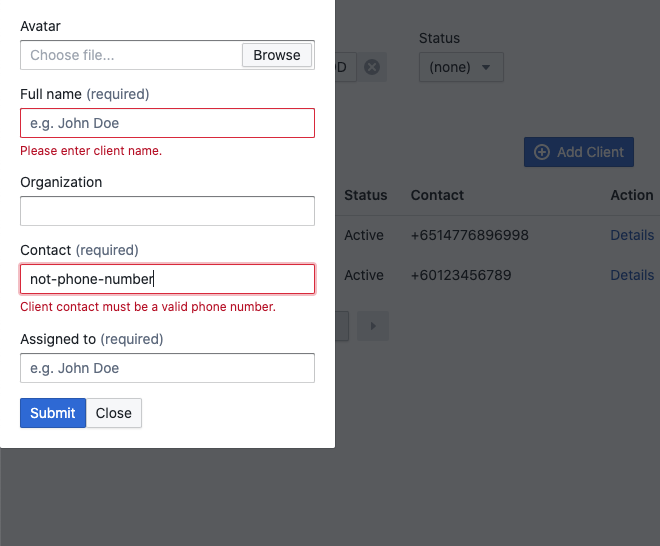

# test-crm

This is a client management web application created using Next.js. A demo of the website can be viewed at https://test-crm-jun-2023.vercel.app/.

## Description

This application consists of two pages:
- Listing page
- Details page

The listing page allows the user to view, filter, and add a new client. By clicking the "Details" link, the user will be led to the corresponding client's details page.




The clients page shows the detailed information about the client, including their avatar, assigned user, organization, and when their profile was created. The user can also change the status of the profile.


## Getting Started

First, run the development server:

```bash
npm run dev
```

Open [http://localhost:3000](http://localhost:3000) with your browser to see the result.

## Deployment

The easiest way to deploy this application is through [Vercel](https://vercel.com). See: https://nextjs.org/learn/basics/deploying-nextjs-app/deploy 
